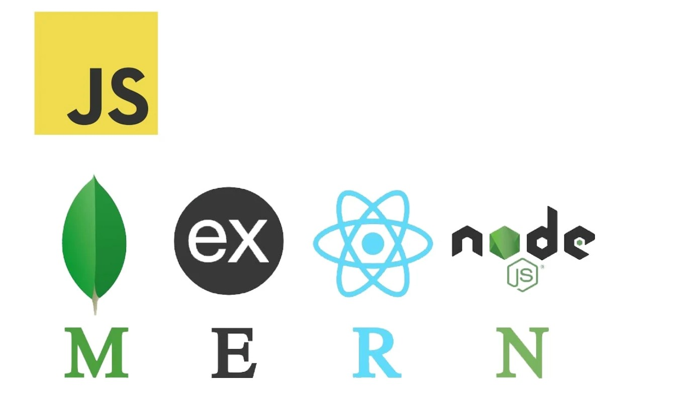
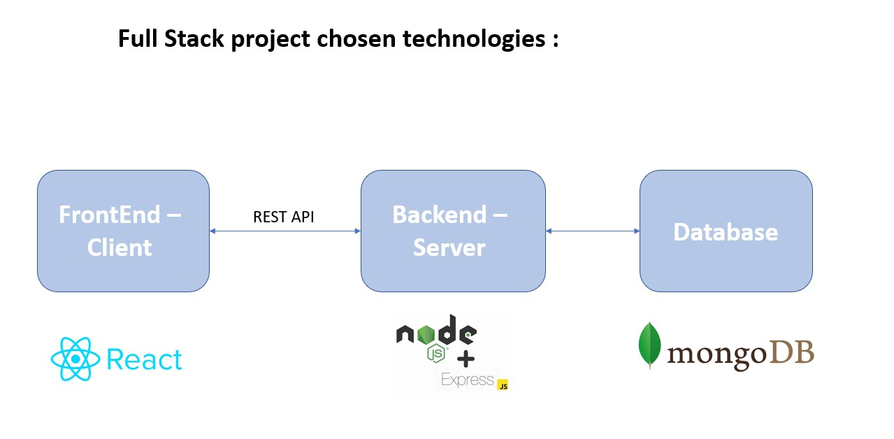
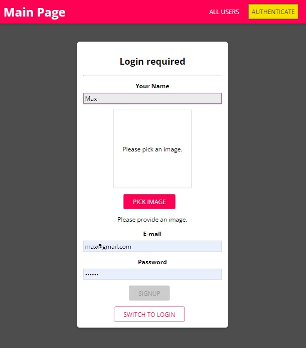
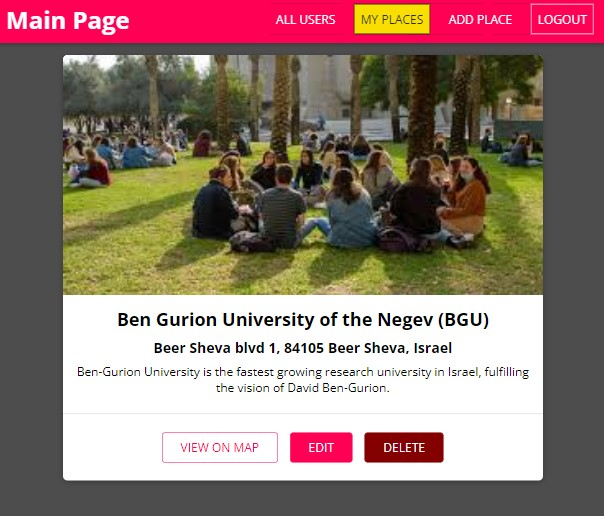

# My MERN Stack Project - SharePlaces App:

**SharePlaces**: This fullstack web application allows people to share their travel experience to a community of other travellers using this application.

_I have done this project using the tools I was given in courses I took in udemy and Shecode_

Motivation for this project:

-Encourage my friends to travel and share their impressions of places they had visited
-Gain more experience with FullStack development especially with MERN architecture

MERN stands for MongoDB, Express, React, Node

**Basic usage description:**

A user can sign up/log in.
Then, in the main page can view all other users in this app.
Can click on some other user to view his places, can pick one and view the place on a map.
Can upload his own place that he had visited, edit and delete it.

### Project Features:

•Feature 1: Create and add a place

•Feature 2: Edit place

•Feature 3: Delete place

•Feature 4: View place (and other people places)

•Feature 5: View place on a map

### What I want to add in the future:

•defaulte picture for a user/ a location

•travel description and cost of travel

•option to rate the place

•main page display users in order by highest ratings
